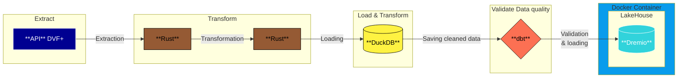

# data-immo

**data-immo** is a high-performance ETL pipeline built in **Rust** to efficiently extract, transform, and load real estate transaction data from the **DVF+ API** into a **Lakehouse (Dremio)**.  

The project is designed with a focus on **performance, reliability, and scalability**, leveraging modern data engineering tools and practices.

## 🔍​ Schema of the pipeline

## 🚀 Features  

- **Data Extraction**  
  - Fetches real estate transaction data from the **DVF+ API**.  
  - Handles API rate limiting, retries, and efficient pagination using Rust’s concurrency model.

- **Data Transformation**  
  - Uses **DuckDB** to transform optimized **Parquet** data into structured, queryable formats.  
  - Rust is used for additional transformations, data enrichment, and performance-critical operations (I/O, etc.).  

- **Data Validation & Loading**  
  - **dbt** is used to validate, test, and model the data.  
  - The cleaned and validated data is loaded into **Dremio**, enabling a Lakehouse architecture.  

## 🛠️ Tech Stack  

- **Rust** → Core language for API calls, transformations, and performance optimization.  
- **DuckDB** → In-process SQL engine for fast transformations of optimized Parquet datasets.  
- **dbt** → Data modeling, testing, and validation layer.  
- **Dremio** → Lakehouse platform for analytics and querying.  

## 📂 Pipeline Overview  

1. **Extract**: Retrieve raw transaction data from DVF+ API.  
2. **Stage**: Store raw data as Parquet.  
3. **Transform**: Apply transformations using DuckDB and Rust.  
4. **Validate & Model**: Use dbt to ensure data quality and prepare final schemas.  
5. **Load**: Push validated datasets into Dremio for downstream analytics.
